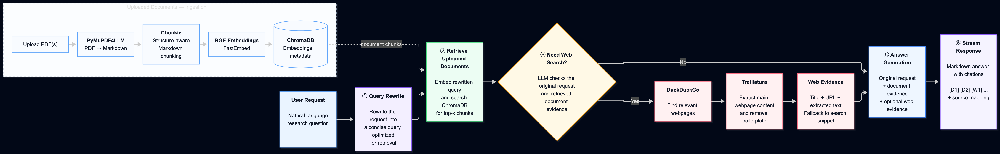

# 1. Setup and run
### Prerequisites
The easiest way to run the project is with Docker. Make sure you have:
- Docker and docker compose installed
- A groq API key - https://console.groq.com/home
- Internet access - the project downloads an embedding model locally

You also need a .env file in the ./backend directory. A .env.example file is provided.  

Clone the project. Then you can start the project with:
```
cd research_agent
docker compose up
```

The services will be available at:      
Frontend: http://localhost:5173     
Backend:  http://localhost:8787

The first startup can take slightly longer because the embedding model needs to be downloaded. Can take a minute or two. 

To stop teh application:
```
docker compose down
```

I like to work in dev containers. Hence I would avoid using docker compose down -v during normal development, since that also deletes docker-managed volumes.


# 2. Architecture and design decisions
The backend is built around two main workflows: document ingestion and research.
The document ingestion flow is:
```
PDF upload
    ↓
PyMuPDF4LLM
    ↓
Markdown
    ↓
Chonkie RecursiveChunker
    ↓
BGE embeddings
    ↓
ChromaDB
```

I initially experimented with heavier document processing libraries like Docling and Unstructured. They offered strong document understanding but brought half the universe's dependencies with them. I soon realized they would add unnecessary bulk to the project and realized they were an overlkill for a weekend project. 

I therefore finalized using PyMuPDF4LLM for this project to convert PDFs to markdown. Its lightweight and does extract the useful structure of the PDF such as headings, lists and tables. 

The next task was chunking. I wanted chunks to respect document structure rather than simply split every N characters or tokens. I initially experimented with markdown-it-py. It offered  information such as token types, tags and nesting levels. While in the zone, I started implementing a custom Markdown section parser. This quickly became a significant amount of parsing code. Since this project had to be completed in a weekend, I went back to research to find a library that does what I had starting manually implementing. 

I settled on Chonkie as it offered exactly where I was stuck at, structure aware recursive chunking. Each chhunk retains metadata such as source filename, page number, chunk index, token count etc. I use this metadata for citations. 

For embeddings I use a BGE embedding model through FastEmbed, with ChromaDB as the persistent local vector store. Documents are embedded when uploaded; research queries are embedded when retrieval is performed.


### Research agent
The research workflow is orchestrated using LangGraph:  
    

    Design note: The workflow is intentionally simple and bounded because it runs on the Groq API free tier. RPM, RPD, and token limits make open-ended agent loops impractical, so the current implementation uses a fixed sequence of retrieval, routing, and answer-generation steps. With higher API limits, I would extend it with iterative search, result evaluation, self-correction, and stopping criteria so the agent could continue researching until sufficient evidence is found.

The first node converts the users request into a query that is better suited for semantic search/retrieval. The rewritten query is used only for retrieval and the original user request is preserved for final answer generation. 

The rewritten query is then embedded and searched against chromadb. The top document chunks are then returned alogn with their source metadat.


There is also an orchestrator (conditional node) for conditional web search. The orchestrator receives:
- the original request
- retrieved document evidence and decides whether external information is required.
The idea is to reduce unnecessary web requests and keep the document specific questions grounded in the uploaded material. 

### Web search
For to web search I considered search APIs such as Tavily, but chose DuckDuckGo through DDGS for the initial implementation because it requires no additional API key and keeps the project easy to run.

My first attempt used DDGS's own extraction functionality. It returned the page contents, but frequently included navigation menus, headers, footers and other boilerplate.
I replaced the extraction step with Trafilatura, which is designed to extract the main readable content of a webpage. This decision also reduced a lot of the document 


### Answer Generation
The final LLM receives the original user request together with the retrieved evidence. It is instructed to answer only from that evidence and cite claims using the supplied source identifiers.

The mapping from document or web to the actual source is created by the backend rather than generated freely by the model.

# 3. Things I would add with more time
The current implementation deliberately favors a small, understandable pipeline over adding more agents. In lieue of available time, the ideology was also to keep the code footprint low while being able to perform what the required tasks are. 

The main improvements I would explore next are:
- Adding support for more filetypes - docx, excel, ppt, etc. 
- reranking of retrieved results. I suggest chunking the retreived webpages and retrieve only the passages that are most relevant to the query. 
- Pages returned by the web search can be fetched concurrently to reduce latency
- Extensive and automated evaluation and regression tests
- Background upload processing/queueing for larger documents or larger number of files. 


# 4. Evaluation and improvements
I would evaluate the system in stages rther than evaluating only the final answer. This is because a RAG system can produce bad answers for several different reasons. Bad parsing would lead to bad chunking then bad retreival, wrong routing. If the evidence to the final model is not good, the generated answer will be unsatisfactory or blatant wrong. 

In my evaluation set, I would make several types of situations/questions. for example

- document only questions
- web search required questions
- mixed document + web questions
- questions with no supported answer

specific evaluation:
1. For document retrieval evaluation, I would primarily measure Recall@k.
2. The web router can be treated as a simple classification problem. (example what does the methodology section say about RAG vs Latest RAG research in 2026)


3. Citation and grounding evaluation for the generated answers I would measure whether:
    1. factual claims are supported by retrieved evidence,
    2. the cited source actually contains the claim,
    3. the model does not introduce unsupported information.

4. For the final answer evaluation I would evaluate:
- correctness
- completeness
- relevance
- faithfulness to retrieved evidence
- citation correctness

5. I would also monitor the latency of different components like
- retreival latency
- embedding latency
- web search latency
- LLM latency
- token usage

# 5. Example inputs and outputs     

(While writing this section my RPD in Free GROQAPI exceeded. Hence could not attach all the responses of the LLM.)  

I have provided 3 PDFs in the backend/public directory. The content are:
1. attention.pdf (Attention is all you need paper)
2. bitcoin.pdf (Original bitcoin whitepaper)
3. jake_resume.pdf (sample resume)

### Example input 1:
input: jake_resume.pdf      
query: where did jake study?        
type: document only search      
response: you should receive the 2 institutions where jake studied at.      

### Example input 2:        
input: jake_resume.pdf      
query: what does jake do?       
type: document only search      
response: You should get a response saying that he is an Undergraduate Research Assistant at Texas A&M University. 

### Example input 3: jake_resume.pdf      
query: what are the roles and responsibilities of an Undergraduate Research Assistant at Texas A&M University?
type: document + web search     
response: you should get a long response of the roles and responsibilities of an Undergraduate Research Assistant at Texas A&M University.      


### Example input 4:        
input: bitcoin.pdf          
query: how does bitcoin secure our transactions?                
type: document only search            
response: 
```
Bitcoin secures transactions through a combination of cryptographic techniques and a decentralized consensus protocol:

| Mechanism | How it works | Evidence |
|-----------|--------------|----------|
| **Digital signatures** | Each transaction is signed by the sender’s private key and can be verified with the sender’s public key. The chain of signatures forms a tamper‑evident record of ownership that a payee can check to confirm the coin’s provenance. | [D5] |
| **Peer‑to‑peer broadcast** | Transactions are sent to all nodes on the network without a central authority. Nodes forward messages on a best‑effort basis, so no single point of failure or trust is required. | [D4] |
| **Proof‑of‑work (PoW) chain** | Transactions are grouped into blocks that include a cryptographic hash of the previous block. Miners must find a nonce that makes the block hash satisfy a difficulty target, which requires substantial computational effort. | [D3] |
| **Longest‑chain rule** | The network accepts the longest chain of PoW blocks as the canonical history. Because extending a chain requires redoing PoW, an attacker would need to control more than 50 % of the network’s CPU power to rewrite history, which is computationally impractical for honest nodes that dominate the network. | [D1] |
| **Consensus without trust** | Nodes “vote” for valid blocks by continuing to mine on them and ignore invalid ones. This consensus mechanism enforces the rules of the protocol and prevents double‑spending without relying on a trusted third party. | [D1] |

In short, Bitcoin uses cryptographic signatures to prove ownership, a PoW‑based blockchain to record and order transactions, and a decentralized consensus protocol that makes it computationally infeasible for an attacker to alter the transaction history. This combination eliminates the need for a trusted intermediary while protecting against fraud and double‑spending.

------

### Document sources

- **[D1]** bitcoin.pdf, page 8
- **[D2]** bitcoin.pdf, page 9
- **[D3]** bitcoin.pdf, page 1
- **[D4]** bitcoin.pdf, page 1
- **[D5]** bitcoin.pdf, page 2
```

### Example input 5
input: attention.pdf    
query: what are positional encodings    
type: document only 
response:
```
**Positional encoding** is a technique used in the Transformer to give the model a sense of the order of tokens in a sequence, because the architecture itself contains no recurrence or convolution.  

- The model adds a *positional encoding vector* to each token’s embedding at the bottom of both the encoder and decoder stacks.  
- These encodings have the same dimensionality as the token embeddings (the model dimension, \(d_{\text{model}}\)), so they can be summed directly with the embeddings.  
- In the original Transformer paper the authors use a *fixed* sinusoidal scheme: each dimension of the encoding corresponds to a sinusoid with a different frequency. The wavelengths form a geometric progression from \(2\pi\) to \(10000 \cdot 2\pi\).  
- The sinusoidal form was chosen because it allows the model to learn to attend based on relative positions; for any fixed offset \(k\), the encoding at position \(pos+k\) can be expressed as a linear function of the encoding at position \(pos\).  
- The authors also experimented with *learned* positional embeddings and found that both approaches produced nearly identical results, but they preferred the sinusoidal version because it may enable the model to extrapolate to sequence lengths longer than those seen during training.  

> *Source: D1*

------

### Document sources

- **[D1]** attention.pdf, page 6
- **[D2]** attention.pdf, page 2
- **[D3]** attention.pdf, page 5
- **[D4]** attention.pdf, page 5
- **[D5]** attention.pdf, page 3
```
